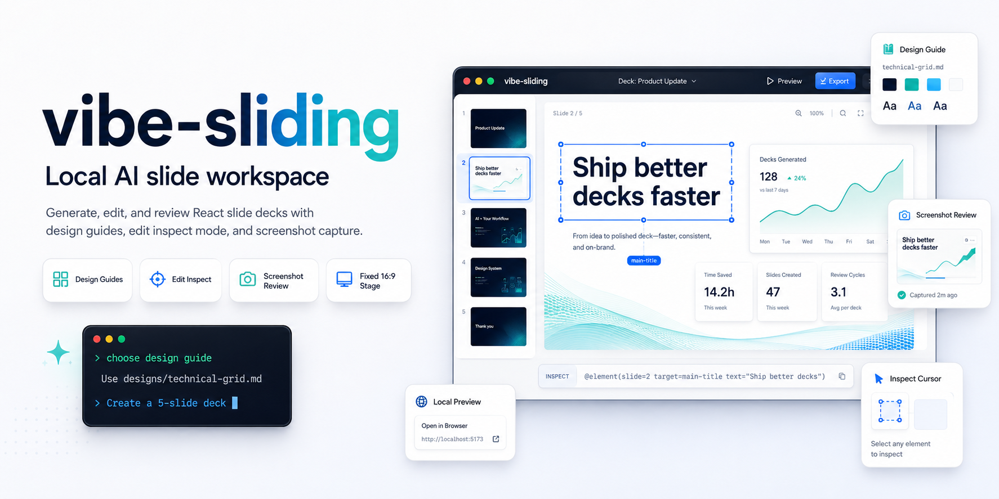
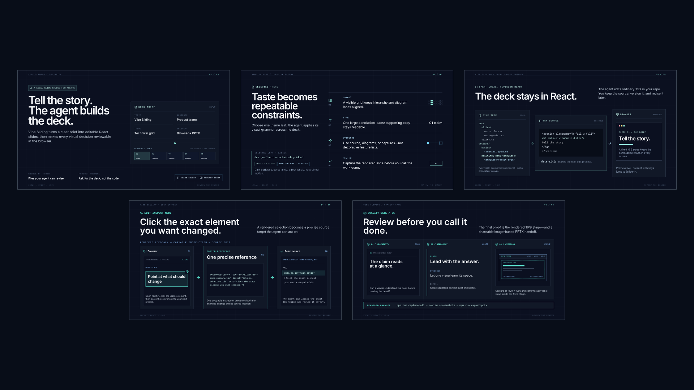

# Vibe Sliding

[English README](README.md)



Vibe Sliding은 AI 코딩 에이전트에게 슬라이드 쇼 생성, 수정, 검토를 맡기기 위한 로컬 작업공간입니다. 사용자는 미리보기 서버를 실행하고, 디자인 가이드를 고르고, 원하는 발표 자료를 설명하면 됩니다. 실제 `src/slides/`의 React 컴포넌트 작성은 AI Agent가 담당합니다.

이 프로젝트는 GUI 중심의 PowerPoint 대체제가 아닙니다. 브라우저는 미리보기와 발표 화면이고, `src/slides/` 아래 파일들은 AI Agent가 사용자를 대신해 수정하는 소스 파일입니다.

## 데모 덱

포함된 데모 덱은 디자인 가이드 선택, Agent에게 덱 요청, 특정 요소 inspect, 생성된 슬라이드 검토 흐름을 보여줍니다.

호스팅된 데모는 [https://neuwcodebox.github.io/vibe-sliding/](https://neuwcodebox.github.io/vibe-sliding/)에서 볼 수 있습니다.



## 빠른 시작

```bash
npm install
npm run dev
```

Vite가 출력한 로컬 URL을 브라우저에서 열면 슬라이드 쇼를 볼 수 있습니다. 보통 `http://localhost:5173/` 형태입니다.

## 이 프로젝트로 얻는 것

- 로컬 브라우저 기반 슬라이드 뷰어
- AI Agent가 안정적으로 수정할 수 있는 React 슬라이드 코드베이스
- `designs/` 아래의 재사용 가능한 디자인 가이드
- 슬라이드 요소를 가리켜 정확한 수정 참조를 복사하는 Edit Inspect Mode
- 생성된 슬라이드를 이미지로 검토하는 screenshot capture 스크립트

의도된 흐름은 “사용자가 슬라이드 쇼를 설명하고, Agent가 소스를 수정하고, 사용자가 브라우저에서 결과를 검토하는 방식”입니다.

## 조작 방법

- 오른쪽 화살표, 아래쪽 화살표, Space, 화면 클릭: 다음 슬라이드
- 왼쪽 화살표 또는 위쪽 화살표: 이전 슬라이드
- Home: 첫 슬라이드
- End: 마지막 슬라이드
- `?slide=N`: N번째 슬라이드 바로 열기
- `?edit=1`: Edit Inspect Mode 켜기

예시:

```txt
http://localhost:5173/?slide=3
http://localhost:5173/?slide=3&edit=1
```

## Agent에게 슬라이드 쇼 생성 요청하기

1. `designs/`에서 발표에 맞는 디자인 가이드를 고릅니다.
2. 주제, 청중, 슬라이드 수, 톤, 반드시 포함할 내용을 Agent에게 설명합니다.
3. Agent에게 슬라이드 컴포넌트를 생성하거나 수정해 달라고 요청합니다.
4. 브라우저에서 결과를 확인합니다.
5. 스크린샷이나 Edit Inspect Mode를 사용해 구체적인 수정 요청을 이어갑니다.

예시 프롬프트:

```txt
Use designs/technical-grid.md. Create a 5-slide deck about our internal AI agent platform for an engineering leadership audience. Keep the style technical, structured, and presentation-ready.
```

전체 스타일을 크게 바꿀 때는 디자인 가이드를 명시하세요. 작은 문구 수정, 오타 수정, 좁은 버그 수정은 기존 슬라이드 스타일을 유지하라고 요청하면 됩니다.

## 디자인 가이드 고르기

기본 제공 가이드:

- `designs/minimal-dark.md`
- `designs/executive-clean.md`
- `designs/technical-grid.md`
- `designs/startup-pitch.md`

디자인 가이드는 Agent에게 주는 시각 지침입니다. 생성될 슬라이드의 비주얼 언어, 밀도, 타이포그래피, 색상, 차트 처리, 모션 등을 설명합니다.

## Agent가 수정하는 파일

슬라이드 생성을 요청하면 Agent는 보통 다음 파일을 수정합니다.

- `src/slides/`: 생성된 슬라이드 컴포넌트
- `src/slides.ts`: 슬라이드 등록 순서
- `designs/`: 새 디자인 가이드나 기존 가이드 수정이 필요할 때만

생성되는 슬라이드는 고정 16:9 스테이지를 채우는 default-export React 컴포넌트입니다.

```tsx
export default function Slide004Topic() {
  return <section className="h-full w-full">...</section>
}
```

Agent는 해당 슬라이드를 `src/slides.ts`에도 등록해야 합니다.

```ts
import Slide004 from './slides/004-topic'

export const slides = [
  // existing slides
  {
    component: Slide004,
    file: 'src/slides/004-topic.tsx',
  },
]
```

사용자가 이 패턴을 외울 필요는 없지만, Agent가 어떤 작업을 해야 하는지 이해하는 데 도움이 됩니다.

## Agent가 정확히 수정할 수 있게 만들기

중요한 제목, 카드, 차트, 섹션에는 `data-ai-id`가 붙어 있으면 이후 수정 요청을 정확히 할 수 있습니다.

```tsx
<h1 data-ai-id="main-title">Quarterly Roadmap</h1>
```

좋은 이름:

- `main-title`
- `cost-chart`
- `workflow-summary`

피해야 할 이름:

- `blue-box`
- `left-thing`
- `big-text`

## Edit Inspect Mode

브라우저에서 특정 요소를 직접 가리킨 뒤 Agent에게 “이 요소를 수정해 달라”고 요청하고 싶을 때 사용합니다.

```txt
http://localhost:5173/?slide=3&edit=1
```

활성화하면 마우스 아래 요소가 강조되고, 클릭하면 한 줄짜리 참조가 복사됩니다.

```txt
@element(slide=3 file="src/slides/003-content.tsx" target="data-ai-id=runtime-flow-title" text="Runtime flow")
```

이 참조를 다음 Agent 요청에 붙여 넣으세요.

```txt
Change @element(slide=3 file="src/slides/003-content.tsx" target="data-ai-id=runtime-flow-title" text="Runtime flow") to make the heading shorter and align it with the chart below.
```

클립보드 접근이 실패하면 화면에 참조가 표시됩니다.

## 스크린샷으로 검토하기

먼저 개발 서버를 켜둡니다.

```bash
npm run dev
```

특정 슬라이드만 캡처합니다.

```bash
npm run capture:slide -- 3
```

전체 슬라이드를 캡처합니다.

```bash
npm run capture:all
```

결과는 `screenshots/slide-001.png`, `screenshots/slide-002.png` 같은 이름으로 저장됩니다. 생성된 PNG 파일은 git에 포함되지 않습니다.

차트나 애니메이션이 있는 슬라이드는 캡처 전에 잠시 기다립니다. 필요하면 대기 시간을 조정할 수 있습니다.

```bash
SLIDE_CAPTURE_SETTLE_MS=2000 npm run capture:slide -- 3
```

## Agent에게 새 디자인 가이드 요청하기

새로운 발표 톤이 필요하면 Agent에게 `designs/` 아래에 새 디자인 가이드를 만들라고 요청하세요.

예시 프롬프트:

```txt
Create a new design guide under designs/ for executive product strategy reviews. Use a restrained, high-density style with strong chart readability.
```

Agent는 `skills/design-guide-authoring/assets/design-guide-template.md`를 구조로 사용하고, `skills/design-guide-authoring/assets/design-guide-example.md`를 완성 예시로 참고해야 합니다.

디자인 가이드는 특정 한 장의 슬라이드 내용이 아니라 여러 슬라이드에 반복 적용할 수 있는 시각 규칙이어야 합니다.

## GitHub Pages에 배포하기

이 프로젝트는 GitHub Actions로 `dist/` 프로덕션 빌드 산출물을 GitHub Pages에 게시할 수 있습니다. 포함된 워크플로는 `main`에 푸시될 때 자동으로 배포하며, Actions 탭에서 수동 실행도 가능합니다.

배포 base path는 `vite.config.ts`에 하드코딩하지 않고 `VITE_BASE_PATH`로 제어합니다. 이 저장소의 프로젝트 사이트용 워크플로에서는 다음 값을 사용합니다.

```txt
VITE_BASE_PATH=/vibe-sliding/
```

프로젝트를 포크하거나, 저장소명을 바꾸거나, 커스텀 도메인을 쓰는 경우 `.github/workflows/deploy-pages.yml`의 `VITE_BASE_PATH`만 수정하면 됩니다. 앱이 도메인 루트에서 제공된다면 `/`를 사용하세요. 로컬 예시는 `.env.example`을 참고하세요.

GitHub에서는 **Settings → Pages → Build and deployment → Source**를 **GitHub Actions**로 설정하세요.

## 검증

타입 검사를 실행합니다.

```bash
npm run typecheck
```

프로덕션 빌드까지 확인합니다.

```bash
npm run build
```

린트를 실행합니다.

```bash
npm run lint
```

## 프로젝트 구조

```txt
src/
  App.tsx
  slides.ts
  runtime/
  edit-mode/
  slides/
  styles/
designs/
skills/
scripts/
public/
screenshots/
```

공유 인프라:

- `src/runtime/`: 뷰어 런타임, 스케일링, 내비게이션
- `src/edit-mode/`: 요소 검사와 복사되는 참조
- `src/styles/global.css`: 앱 전역 기본 스타일

덱별 콘텐츠:

- `src/slides/`: Agent가 생성하는 슬라이드 컴포넌트
- `src/slides.ts`: 슬라이드 등록 순서
- `designs/`: Agent에게 주는 시각 지침
- `screenshots/`: 캡처된 슬라이드 이미지

대부분의 발표 내용과 시각 수정은 `src/slides/` 안에서 해결해야 합니다. `runtime/`, `edit-mode/`, `styles/global.css`는 여러 슬라이드 쇼에서 재사용되는 일반 인프라로 유지해야 합니다.
