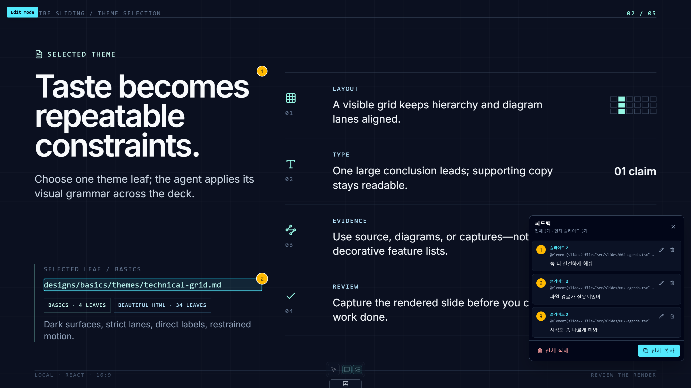
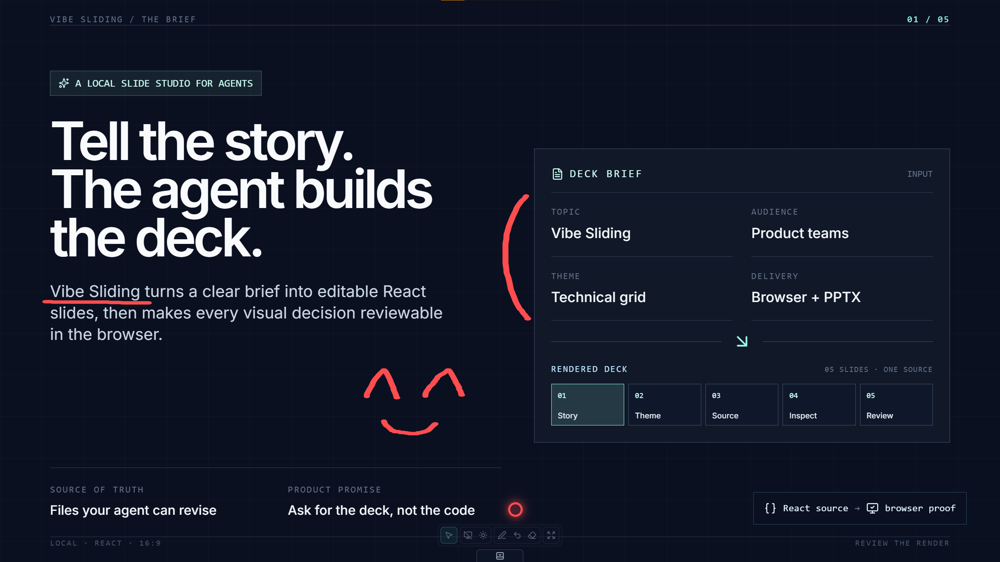
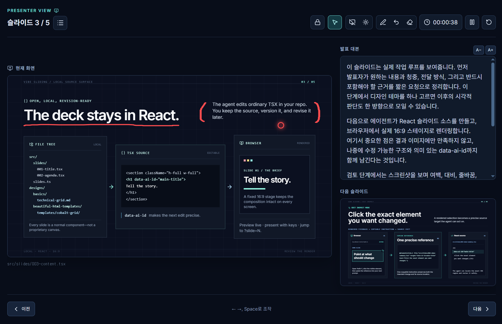

# Vibe Sliding

[한국어 README](README.ko.md)


Vibe Sliding is a local workspace for creating, presenting, and reviewing slide decks with an AI coding agent. You describe the deck, the agent edits plain React components, and the browser becomes the preview and presentation surface.

It is not a GUI-first PowerPoint replacement. The source of truth is the code under `src/slides/`; screenshots and PPTX files are outputs generated from the same browser rendering path.

The included demo deck walks through that workflow. A hosted copy is available at [neuwcodebox.github.io/vibe-sliding](https://neuwcodebox.github.io/vibe-sliding/).


## Quick start

```bash
npm install
npm run dev
```

Open the local URL printed by Vite, usually `http://localhost:5173/`.

The normal workflow is:

1. Choose one design leaf, or explicitly let the agent choose it.
2. Describe the audience, purpose, slide count, tone, and required content.
3. Let the agent create or revise `src/slides/` and `src/slides.ts`.
4. Review the rendered deck in the browser.
5. Use Edit Mode or screenshots to request precise revisions.
6. Present in the browser or export the finished deck to PPTX.

## Create or revise a deck

### Brief the agent

A useful request identifies both the content job and the controlling design direction.

```txt
Use designs/basics/themes/technical-grid.md. Create a 5-slide deck about our internal AI agent platform for an engineering leadership audience. Keep the style technical, structured, and presentation-ready.
```

For a new deck or broad redesign, name one design leaf or explicitly delegate the choice. If neither happens, the agent should ask before changing the visual system. For a typo, copy adjustment, or other narrow fix, preserve the current deck style.

### Choose one design leaf

[`designs/README.md`](designs/README.md) is the catalog and selection guide. Its immediate child directories are peer collections, but they supply different levels of design guidance.

| Collection | Selectable leaf | Design level |
| --- | --- | --- |
| [`basics/`](designs/basics/README.md) | A `themes/<theme>.md` file listed in `index.json` | Complete design system |
| [`beautiful-html-templates/`](designs/beautiful-html-templates/) | A `templates/<theme>/` directory | Slide template and repeatable structures |
| [`pptx-design-styles/`](designs/pptx-design-styles/) | A file under `styles/` listed in `index.json` | Visual style reference |

A collection README, `index.json`, license, or provenance file helps with browsing; it is not a selectable leaf. Use one leaf as the deck's controlling direction rather than blending two themes as co-equal systems. The choice belongs in the task and is never stored in project configuration.

Examples:

```txt
Use designs/basics/themes/technical-grid.md as the theme. Create a 5-slide architecture review for engineering leaders.
```

```txt
Use designs/beautiful-html-templates/templates/cobalt-grid/ as the theme. Create a 5-slide product demo for engineering leaders.
```

Browse each collection according to its design level:

- For Basics, shortlist with `basics/index.json`, then read the selected Markdown design system.
- For Beautiful HTML Templates, shortlist with `index.json`, then read only the relevant `template.json` and `design.md`. Open `template.html` only when a structural implementation detail is needed. Adapt its visual grammar to the fixed 1920×1080 React stage and installed fonts; never import its HTML runtime, sample copy, navigation, or remote-font setup.
- For PPTX Design Styles, shortlist with `index.json`, then read the selected style file. A style reference supplies visual cues, so the deck's claims, evidence, and compositions still need to be authored.

### Understand what the agent edits

Ordinary deck work should stay in:

- `src/slides/`: deck-specific React slide components
- `src/slides.ts`: explicit registration order, source paths, and optional speaker notes

Choosing a design leaf does not modify `designs/`. That directory changes only when you explicitly request a reusable design addition, revision, or upstream snapshot update.

Each slide is a default-exported component whose root fills the fixed 16:9 stage.

```tsx
export default function Slide004Topic() {
  return <section className="h-full w-full">...</section>
}
```

Register it in `src/slides.ts`:

```ts
import Slide004 from './slides/004-topic'

export const slides = [
  {
    component: Slide004,
    file: 'src/slides/004-topic.tsx',
    notes: ['Introduce the decision first.', 'Pause here for questions.'],
  },
]
```

`notes` is optional. Each string becomes a paragraph in Presenter View and never appears on the audience screen.

Shared viewer behavior belongs in `src/runtime/` and `src/edit-mode/`; deck-specific layout fixes should not be implemented there or in `src/styles/global.css`.

### Add Mermaid diagrams

Use `MermaidDiagram` for flowcharts, sequence diagrams, and other Mermaid-supported visuals.

```tsx
import { MermaidDiagram } from '../runtime/MermaidDiagram'

const chart = `---
config:
  theme: base
  themeVariables:
    darkMode: true
    background: '#0B1020'
    primaryColor: '#111827'
    primaryTextColor: '#F8FAFC'
    primaryBorderColor: '#334155'
    lineColor: '#5EEAD4'
    fontFamily: 'Inter, Noto Sans KR, sans-serif'
---
flowchart LR
  A[Prompt] --> B[React slide]
  B --> C[Browser review]
`

export default function Slide004Topic() {
  return <MermaidDiagram chart={chart} className="h-[420px]" />
}
```

YAML frontmatter is the preferred way to set a per-diagram theme. Mermaid `%%{init:...}%%` directives may remain compatible, but new slides should use frontmatter.

### Make future edits targetable

Give important titles, cards, charts, and sections stable `data-ai-id` attributes.

```tsx
<h1 data-ai-id="main-title">Quarterly Roadmap</h1>
```

Prefer meaning-based names such as `main-title`, `cost-chart`, and `workflow-summary`. Avoid appearance-based names such as `blue-box`, `left-thing`, or `big-text`.

## Review and refine

### Use Edit Mode for exact references and feedback

Open Edit Mode with `?edit=1`.

```txt
http://localhost:5173/?slide=3&edit=1
```

Normal click-to-advance is disabled while editing. Hovering slide content outlines the exact element that will be targeted. The bottom presentation toolbar is replaced by an edit toolbar with these shortcuts:

| Input | Action |
| --- | --- |
| `E` | Toggle Edit Mode |
| `Esc` | Leave Edit Mode; close an open feedback dialog or list first |
| `R` | Select Reference, then click an element to copy its one-line `@element(...)` reference |
| `F` | Select Feedback, then click an element to add or edit anchored feedback |
| `V` | Open or close the accumulated feedback list |

A copied reference looks like this:

```txt
@element(slide=3 file="src/slides/003-content.tsx" target="data-ai-id=runtime-flow-title" text="Runtime flow")
```

Paste it into a focused request:

```txt
Change @element(slide=3 file="src/slides/003-content.tsx" target="data-ai-id=runtime-flow-title" text="Runtime flow") to make the heading shorter and align it with the chart below.
```

Feedback is numbered across the session. Each saved item appears as a numbered bubble beside its element. Hover the bubble to outline the referenced element; select the bubble to edit or delete the feedback. In the feedback list you can:

- select a number to jump to and focus its bubble, including on another slide;
- edit or delete an individual item;
- clear all feedback;
- copy all references and feedback as one prompt.



The copied batch format is:

```txt
1. @element(...)
First feedback item

---

2. @element(...)
Second feedback item
```

Feedback is kept in the current browser session and is cleared by a page reload. If clipboard access fails, the content is shown on screen for manual copying.

### Review with screenshots

Keep the dev server running, then capture one slide or the full registered deck.

```bash
npm run capture:slide -- 3
npm run capture:all
```

Images are written as `screenshots/slide-001.png`, `screenshots/slide-002.png`, and so on. Generated screenshots are ignored by git.

After changing the included demo deck, refresh the checked-in grid used in this README:

```bash
npm run capture:all
npm run capture:demo-grid
```

The grid is generated from the slides currently registered in `src/slides.ts` and written to `docs/demo-slides-grid.png`. Increase the settling time for charts or animations when needed:

```bash
SLIDE_CAPTURE_SETTLE_MS=2000 npm run capture:slide -- 3
```

## Present the deck

### Navigate the audience view

| Input | Action |
| --- | --- |
| `Right` / `Down` / `Space` / stage click | Next slide |
| `Left` / `Up` | Previous slide |
| `Home` / `End` | First / last slide |
| `?slide=N` | Open slide N directly |
| `P` | Open Presenter View in a popup |

Useful direct URLs:

```txt
http://localhost:5173/?slide=3
http://localhost:5173/?slide=3&edit=1
http://localhost:5173/?slide=3&presenter=1
```

When Presenter View is not open, a small translucent tab at the bottom center expands the audience controls. It provides black/white screen, laser, pen, undo, clear, and fullscreen actions without adding persistent slide chrome.

Audience controls:

| Input | Action |
| --- | --- |
| `B` / `W` | Toggle a black / white audience screen |
| `R` | Toggle the laser pointer |
| `D` | Toggle pen annotations |
| `Z` | Undo the latest pen stroke |
| `C` | Clear annotations on the current slide |
| `F` | Enter or exit browser fullscreen |



### Use Presenter View

Press `P` in the audience view to open Presenter View as a separate popup, or open `?presenter=1` directly. Keep the popup on the presenter's monitor and the original window on the audience display. Presenter View shows the current and next slide, optional speaker notes, elapsed timer, and a slide list without adding presenter UI to the audience screen. It synchronizes slide changes, pointer position, pen strokes, and audience-screen states with the audience window.



Presenter controls:

| Input | Action |
| --- | --- |
| `B` / `W` | Toggle a black / white audience screen |
| `R` | Toggle the synchronized laser pointer |
| `D` | Toggle synchronized pen annotations |
| `Z` | Undo the latest pen stroke |
| `C` | Clear annotations on the current slide |
| `F` | Freeze or resume audience synchronization |

## Export to PowerPoint

Both export paths use the browser renderer, so start the dev server first.

Image-based export offers the highest visual fidelity:

```bash
npm run export:pptx
npm run export:pptx -- exports/demo.pptx
```

The default file is `exports/vibe-sliding.pptx`. Each slide is a full-slide PNG, so it presents reliably in PowerPoint but its individual text, shapes, charts, and diagrams are not editable.

Experimental editable export converts the unscaled 1920×1080 DOM with `dom-to-pptx`:

```bash
npm run export:pptx:editable
npm run export:pptx:editable -- exports/demo-editable.pptx
```

The default file is `exports/vibe-sliding-editable.pptx`. Use it when editability matters, but expect some charts, Mermaid diagrams, SVGs, advanced CSS, and effects to be partially converted or preserved as image/SVG objects.

Point either exporter at another server or increase the settling time when needed:

```bash
SLIDE_BASE_URL=http://localhost:4173 npm run export:pptx
SLIDE_CAPTURE_SETTLE_MS=2000 npm run export:pptx:editable
```

## Extend and publish the workspace

### Add a reusable Basics design system

Ask for a new Basics leaf only when none of the existing leaves across the collections provides a direction worth reusing.

```txt
Create a new Basics theme under designs/basics/ for executive product strategy reviews. Use a restrained, high-density style with strong chart readability.
```

The agent should use `.agents/skills/design-guide-authoring/assets/design-guide-template.md` as the structure and `.agents/skills/design-guide-authoring/assets/design-guide-example.md` as a completed reference. A Basics leaf defines reusable rules across decks; it should not be a single-slide outline or a duplicate restatement of an upstream design.

### Deploy to GitHub Pages

The included GitHub Actions workflow builds `dist/` on pushes to `main` and can also be run manually. In GitHub, set **Settings → Pages → Build and deployment → Source** to **GitHub Actions**.

The workflow controls the deployment base path with `VITE_BASE_PATH`:

```txt
VITE_BASE_PATH=/vibe-sliding/
```

If you fork or rename the repository, or use a custom domain, update the value in `.github/workflows/deploy-pages.yml`. Use `/` when serving from a domain root. See `.env.example` for local examples.

## Development reference

### Commands

| Command | Purpose |
| --- | --- |
| `npm run dev` | Start the Vite development server |
| `npm run preview` | Preview the production build |
| `npm run typecheck` | Run TypeScript checks |
| `npm run lint` | Run ESLint |
| `npm run build` | Typecheck and create `dist/` |
| `npm run capture:slide -- N` | Capture one registered slide |
| `npm run capture:all` | Capture all registered slides |
| `npm run capture:demo-grid` | Rebuild the checked-in demo grid |
| `npm run export:pptx` | Export an image-based PPTX |
| `npm run export:pptx:editable` | Export an experimental editable PPTX |

### Project structure

```txt
src/
  App.tsx
  slides.ts
  runtime/
  edit-mode/
  slides/
  styles/
designs/
  README.md
  basics/
  beautiful-html-templates/
  pptx-design-styles/
skills/
scripts/
public/
screenshots/
exports/
```

- `src/runtime/`: generic viewer, scaling, navigation, and presenter behavior
- `src/edit-mode/`: generic element inspection, references, and feedback UI
- `src/styles/global.css`: app-wide runtime and font styling
- `src/slides/`: deck-specific React components
- `src/slides.ts`: explicit slide registry and optional notes
- `designs/`: design-system, slide-template, and style-reference collections
- `screenshots/`: generated review images
- `exports/`: generated PPTX files

## Third-party sources

- [`yetone/kill-ai-slop`](https://github.com/yetone/kill-ai-slop) — [Apache-2.0](.agents/skills/kill-ai-slop/LICENSE), preserved in [`.agents/skills/kill-ai-slop/`](.agents/skills/kill-ai-slop/)
- [`zarazhangrui/beautiful-html-templates`](https://github.com/zarazhangrui/beautiful-html-templates) — [MIT](designs/beautiful-html-templates/LICENSE), preserved in [`designs/beautiful-html-templates/`](designs/beautiful-html-templates/)
- [`corazzon/pptx-design-styles`](https://github.com/corazzon/pptx-design-styles) — [MIT declaration](designs/pptx-design-styles/LICENSE), preserved as split style references in [`designs/pptx-design-styles/`](designs/pptx-design-styles/)
